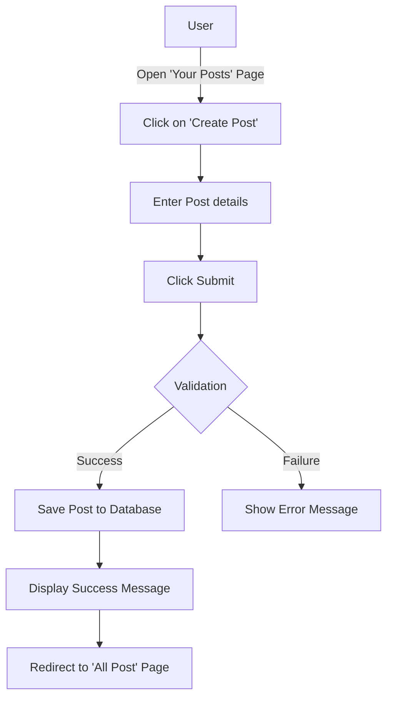
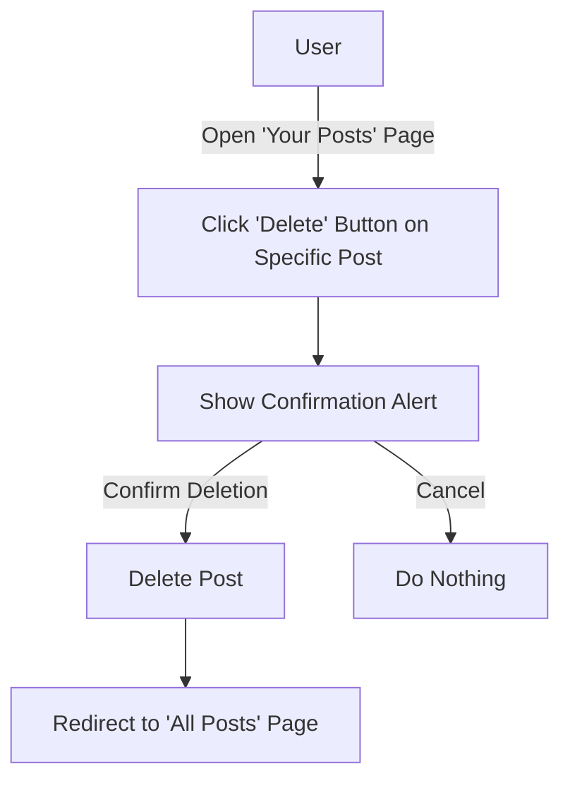
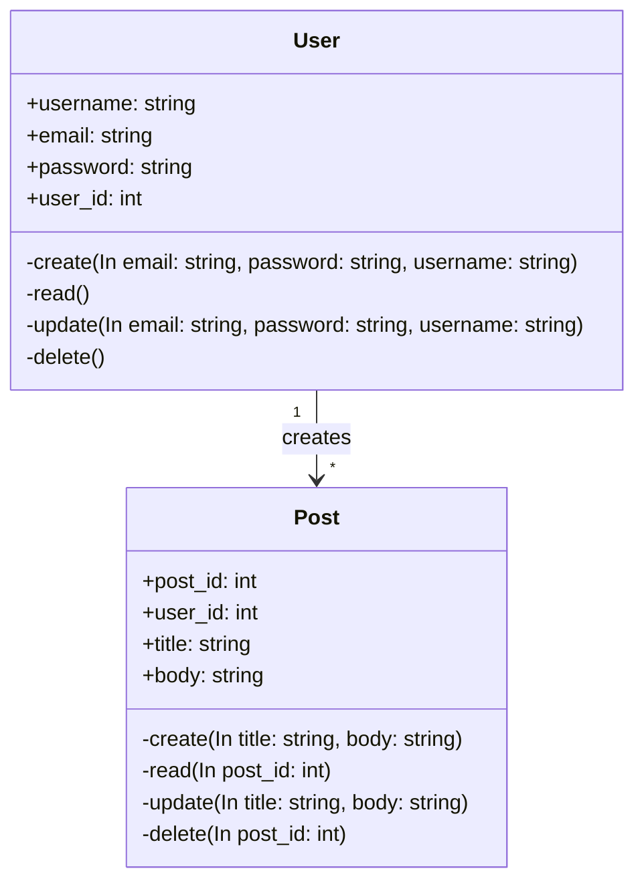

# Kine123649-WebAdvance-N09
# php artisan serve --port=9763
# Thông tin về project:
    - Là một trang Web cho phép mọi người tạo tài khoản và đăng các bài post với nội dung mong muốn.
    - Hiện tại đang có 2 models là User và Post cùng với các chức năng cơ bản (CRUD).
    - Web-app được xây dựng cơ bản nhưng vẫn đảm bảo tính linh hoạt và khả năng mở rộng trong tương lai.

## Activity Diagram (Ví dụ cho chức năng create)

## Activity Diagram (Ví dụ cho chức năng delete)

## Class Diagram
