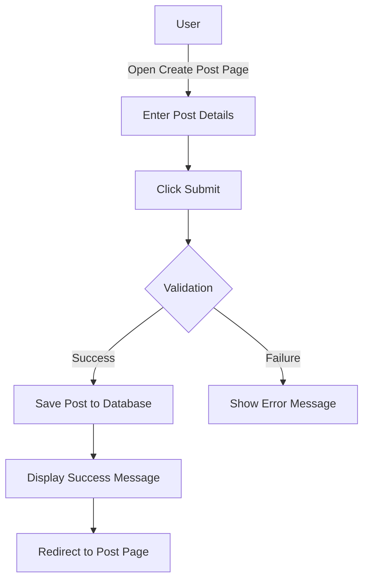
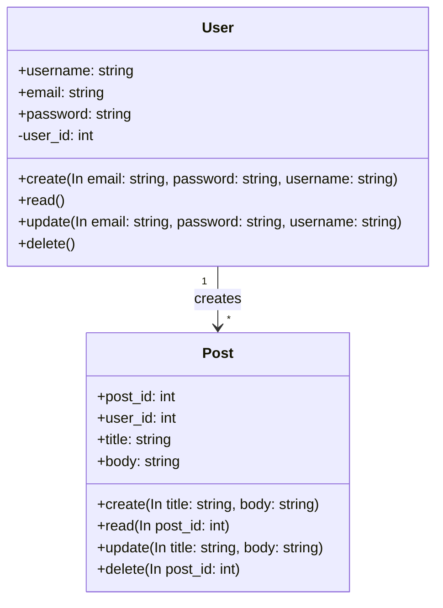

# Kine123649-WebAdvance-N09
# php artisan serve --port=9763
# Create Post - Diagrams

## Activity Diagram

```mermaid
flowchart TD
  A[User] -->|Open Create Post Page| B[Enter Post Details];
    B --> D[Click Submit];
    D --> E{Validation};
    E -- Success --> F[Save Post to Database];
    E -- Failure --> G[Show Error Message];
    F --> H[Display Success Message];
    H --> I[Redirect to Post Page];
```

## Class Diagram

```mermaid
classDiagram
    class User {
        +username: string
        +email: string
        +password: string
        -user_id: int
        +create(In email: string, password: string, username: string)
        +read()
        +update(In email: string, password: string, username: string)
        +delete()
    }

    class Post {
        +post_id: int
        +user_id: int
        +title: string
        +body: string
        +create(In title: string, body: string)
        +read(In post_id: int)
        +update(In title: string, body: string)
        +delete(In post_id: int)
    }
     User "1" --> "*" Post : creates
```